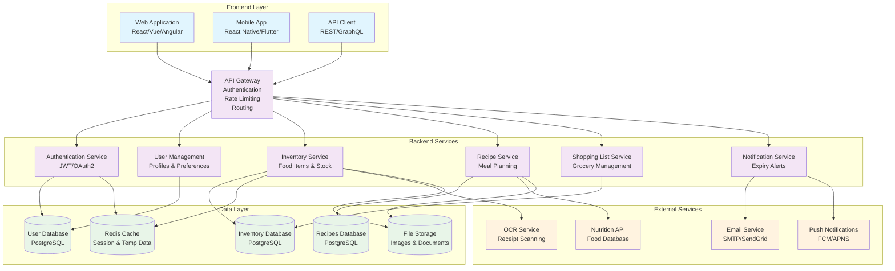

# Food Manager Architecture

## System Architecture Diagram

## Component Descriptions

### Frontend Layer
- **Web Application**: Modern SPA for desktop/laptop users
- **Mobile App**: Native or cross-platform app for mobile users
- **API Client**: SDK for third-party integrations

### Backend Services
- **API Gateway**: Central entry point with authentication, rate limiting, and routing
- **Authentication Service**: Handles user login, JWT tokens, and OAuth2
- **User Management**: User profiles, preferences, and account settings
- **Inventory Service**: Manages food items, stock levels, and expiry tracking
- **Recipe Service**: Recipe storage, meal planning, and nutrition calculation
- **Shopping List Service**: Grocery list generation and management
- **Notification Service**: Sends alerts for expiring items and reminders

### Data Layer
- **User Database**: Stores user accounts and preferences
- **Inventory Database**: Food items, stock levels, and purchase history
- **Recipes Database**: Recipe data and meal plans
- **Redis Cache**: Session management and temporary data
- **File Storage**: Images, documents, and receipt scans

### External Services
- **Email Service**: Sends notifications and reports
- **Push Notifications**: Mobile app notifications
- **OCR Service**: Scans receipts to automatically add items
- **Nutrition API**: Provides nutritional information for foods

## Technology Stack Recommendations

### Frontend
- **Web**: React.js with TypeScript
- **Mobile**: React Native or Flutter
- **State Management**: Redux Toolkit or Zustand

### Backend
- **API**: Node.js with Express or Python with FastAPI
- **Authentication**: JWT with refresh tokens
- **Database**: PostgreSQL for relational data
- **Cache**: Redis for session and temporary data

### Infrastructure
- **Containerization**: Docker
- **Orchestration**: Kubernetes or Docker Compose
- **CI/CD**: GitHub Actions or GitLab CI
- **Monitoring**: Prometheus + Grafana
- **Logging**: ELK Stack (Elasticsearch, Logstash, Kibana)

## Data Flow

1. **User Registration/Login**: User authenticates through the API Gateway
2. **Food Management**: Users add items to inventory via web/mobile app
3. **Recipe Planning**: Users create recipes and meal plans
4. **Shopping Lists**: System generates shopping lists based on recipes and inventory
5. **Notifications**: System sends alerts for expiring items and meal reminders
6. **Receipt Scanning**: OCR service processes receipts to auto-populate inventory
